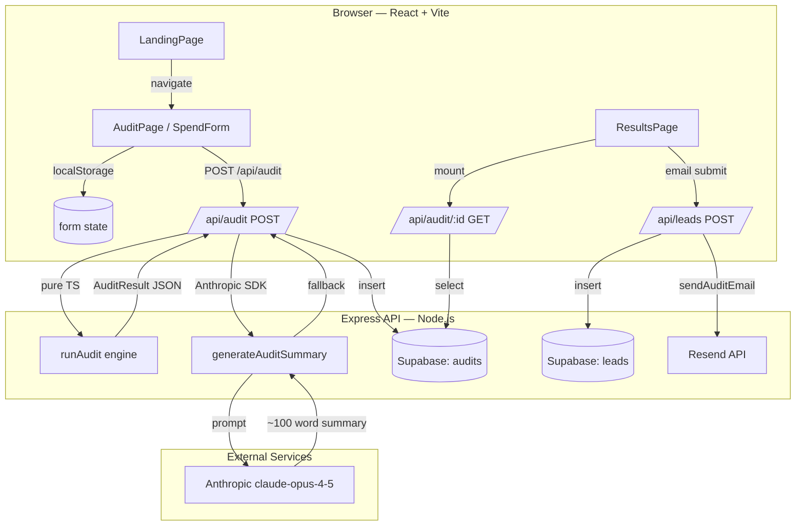

# Architecture — SpendLens

## System Diagram

## Data Flow: Form Input → Audit Result

1. **User fills SpendForm** → React Hook Form + Zod validates client-side → state persisted to localStorage on every change
2. **Submit** → `POST /api/audit` with `AuditInput` JSON
3. **Server runs** `runAudit(input)` — pure TypeScript, no network calls, instantaneous
4. **Server calls** `generateAuditSummary(auditResult)` → Anthropic API → 100-word summary (or fallback if API unavailable)
5. **Server inserts** full `AuditResult` to Supabase `audits` table, tool rows to `audit_tools`
6. **Response** returns full `AuditResult` with UUID
7. **Browser redirects** to `/audit/:id`, passing result via React Router `state` (avoids second fetch on fresh navigation)
8. **Results page** renders from state OR fetches from `GET /api/audit/:id` (for direct link / share URL visitors)
9. **Email submit** → `POST /api/leads` → Supabase insert + Resend email (fire-and-forget)

## Stack Reasoning

| Decision | Rationale |
|---|---|
| **React + Vite** (not Next.js) | Assignment specifies React + Vite. Vite's HMR is faster for form-heavy development. SSR not needed — audit results are fetched client-side; OG tags are set via React Helmet from fetched data. |
| **Express** (not Next.js API routes) | Separate deployable backend enables independent scaling. Express is well-understood, minimal overhead, and Render/Railway deploy is straightforward. |
| **TypeScript throughout** | Shared types between audit engine logic and API routes/client prevent type drift. The `AuditResult` interface is the contract between frontend and backend. |
| **Supabase** (not PlanetScale/Neon) | Generous free tier, real PostgreSQL, excellent JS client, RLS for public audit reads without exposing leads. |
| **Resend** (not SendGrid/Postmark) | Clean React-friendly API, best deliverability at free tier volumes, simple transactional email HTML. |
| **Framer Motion** (not CSS only) | Assignment requires it. Used conservatively — entrance animations on Hero and card reveals. Not over-animated. |

## What Changes at 10k Audits/Day

1. **Rate limiting**: Replace in-memory `express-rate-limit` with Upstash Redis (`@upstash/ratelimit`). Middleware swap, no route changes.
2. **Audit summary**: Queue generation via Inngest or Trigger.dev so the `/api/audit` response doesn't wait for Anthropic. Store summary separately and poll from client.
3. **Supabase**: Enable read replica for `audits` table. Audit inserts are write-once; reads (results page, shared URL) should hit replica.
4. **Static OG images**: Replace SVG `/api/og` response with `@vercel/og` on the frontend using Vercel's edge runtime for proper image rendering.
5. **Analytics**: Add PostHog event tracking: `audit_started`, `audit_completed`, `email_captured`, `credex_cta_clicked`. These four events close the entire conversion funnel.
6. **Caching**: Redis cache for `GET /api/audit/:id` — audit data never changes after creation. TTL 7 days.

## Security Model

- All secrets via environment variables, never committed
- Supabase RLS: `audits` table public-readable (intentional — shareable URLs), `leads` table service-role-only
- Honeypot field on lead capture form (invisible input that bots fill)
- `express-rate-limit` on all routes: 100 req/15min general, 10 req/hr on leads, 20 req/min on audit
- `helmet()` sets security headers (CSP, HSTS, X-Frame-Options)
- Zod validation on all API inputs before any DB interaction
- No user PII in the `audits` table — personal info is only in `leads`
